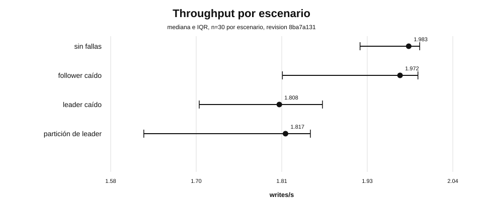
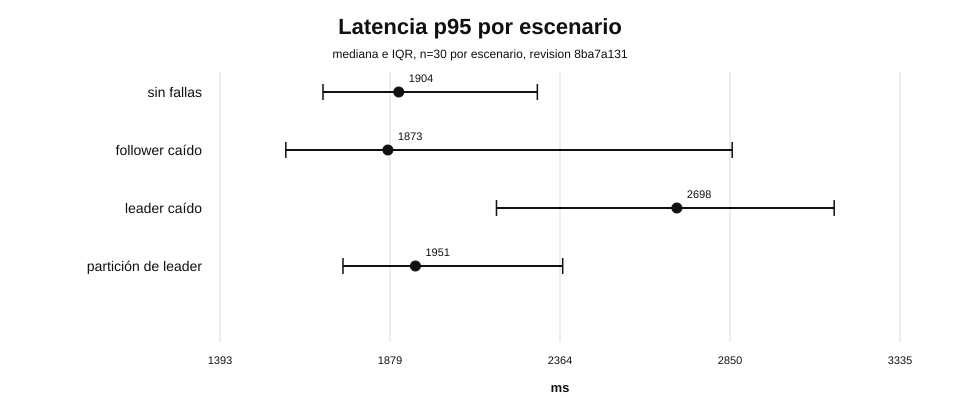
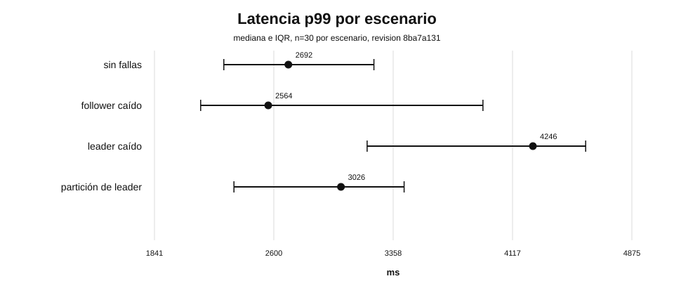
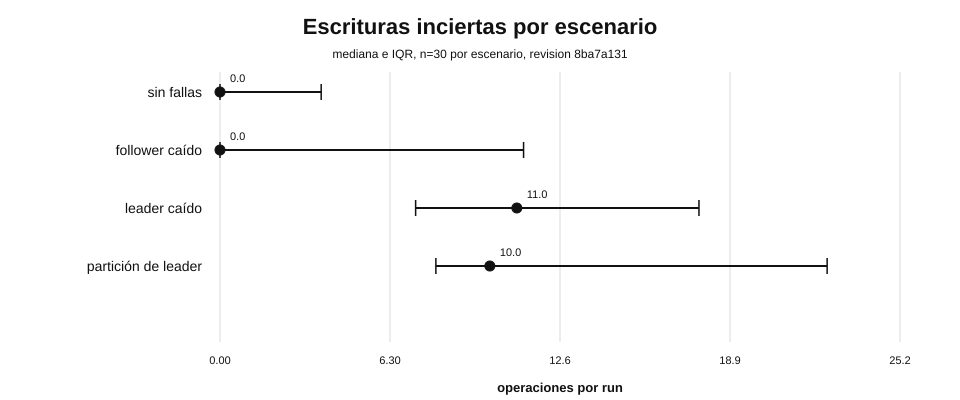

### Resultados de la campaña experimental final

Este documento resume los resultados descriptivos e inferenciales de la campaña experimental final de RaftKV.

La campaña corresponde a la revisión experimental:

```text
8ba7a131c4f452aac014a4c628794062fa1a8c9b
```

La interpretación de estos resultados debe realizarse conjuntamente con:

```text
experiments/METHODOLOGY.md
experiments/STATISTICAL_ANALYSIS.md
experiments/THREATS_TO_VALIDITY.md
experiments/ARTIFACT_REPRODUCTION.md
```

La unidad estadística es el run completo. Las operaciones individuales dentro de un mismo run no se tratan como observaciones independientes.

#### Diseño analizado

La campaña incluye cuatro escenarios:

```text
sin fallas
follower caído
leader caído
partición de leader
```

Cada escenario aporta 30 runs válidos, para un total de 120 runs.

La carga final utiliza:

```text
nodos: 5
duración: 60 s
clientes: 16
operaciones por segundo: 2
semilla del workload: 42
```

Los escenarios con falla la aplican aproximadamente a los 20 segundos durante 10 segundos.

El análisis H2 compara únicamente cada escenario de falla contra el baseline `sin fallas`.

La familia inferencial contiene:

```text
3 escenarios de falla
6 métricas
18 comparaciones
```

El análisis utiliza:

```text
bootstrap: 100000 réplicas
permutación: 100000 réplicas
confidence level: 0.95
alpha: 0.05
corrección por multiplicidad: Holm
analysis seed: 20260912
```

#### Resumen descriptivo

Las siguientes cifras son medianas calculadas sobre los 30 runs de cada escenario.

| Escenario | Throughput (writes/s) | p50 (ms) | p95 (ms) | p99 (ms) | Inciertas | Omitidas |
| --- | ---: | ---: | ---: | ---: | ---: | ---: |
| Sin fallas | 1.983 | 418.087 | 1903.720 | 2692.064 | 0 | 0 |
| Follower caído | 1.972 | 423.315 | 1872.698 | 2564.284 | 0 | 0 |
| Leader caído | 1.808 | 410.819 | 2697.890 | 4246.179 | 11 | 0 |
| Partición de leader | 1.817 | 391.942 | 1951.367 | 3026.359 | 10 | 0 |

El baseline presenta una mediana de throughput de 1.983 writes/s.

La caída de un follower mantiene medianas próximas al baseline en throughput y latencias.

La caída del leader reduce la mediana de throughput a 1.808 writes/s y eleva de forma marcada las medianas de p95 y p99.

La partición del leader reduce la mediana de throughput a 1.817 writes/s y eleva la mediana de operaciones inciertas a 10.

Las medianas iguales a cero en `uncertain_writes` u `omitted_operations` no implican ausencia de variación en todos los runs. Los descriptivos completos, incluidos Q1, Q3, máximo, IQR y MAD, se conservan en:

```text
experiments/processed/8ba7a131c4f452aac014a4c628794062fa1a8c9b/final/statistics/descriptive.csv
```

#### Comparaciones con evidencia después de Holm

De las 18 comparaciones inferenciales, 6 conservan un valor p ajustado por Holm menor que 0.05.

| Escenario | Métrica | Diferencia de medianas | IC bootstrap 95 % | Cliff's delta | p ajustado Holm |
| --- | --- | ---: | --- | ---: | ---: |
| Leader caído | Throughput | -0.175 writes/s | [-0.246, -0.123] | -0.760 | 0.001050 |
| Leader caído | p95 | +794.170 ms | [366.317, 1167.270] | 0.627 | 0.000340 |
| Leader caído | p99 | +1554.115 ms | [1119.865, 2037.598] | 0.700 | 0.000180 |
| Leader caído | Operaciones inciertas | +11 | [8, 15] | 0.786 | 0.002660 |
| Partición de leader | Throughput | -0.167 writes/s | [-0.300, -0.133] | -0.804 | 0.000480 |
| Partición de leader | Operaciones inciertas | +10 | [8.5, 17] | 0.820 | 0.007410 |

Los valores p se interpretan como evidencia complementaria. La magnitud y dirección del efecto, los intervalos bootstrap y Cliff's delta son parte principal de la interpretación.

#### Follower caído

La comparación entre `follower caído` y `sin fallas` no conserva evidencia robusta después del ajuste Holm en ninguna de las seis métricas analizadas.

Para throughput:

```text
baseline median = 1.9833 writes/s
follower median = 1.9716 writes/s
difference = -0.0117 writes/s
95 % bootstrap CI = [-0.0918, 0.0096]
Cliff's delta = -0.1511
Holm adjusted p = 1
```

El intervalo bootstrap de la diferencia cruza cero y el intervalo de Cliff's delta también contiene cero.

Los resultados son compatibles con un comportamiento cercano al baseline bajo la carga estudiada, aunque los descriptivos muestran mayor dispersión en varios runs del escenario de follower caído.

No debe interpretarse este resultado como prueba de equivalencia entre escenarios.

#### Leader caído

La caída del leader produce el patrón más claro de degradación.

El throughput disminuye:

```text
baseline median = 1.9833 writes/s
leader-down median = 1.8083 writes/s
difference = -0.1750 writes/s
relative change = -8.82 %
95 % bootstrap CI = [-0.2455, -0.1227]
Cliff's delta = -0.7600
Holm adjusted p = 0.001050
```

La latencia p95 aumenta:

```text
baseline median = 1903.720 ms
leader-down median = 2697.890 ms
difference = +794.170 ms
relative change = +41.72 %
95 % bootstrap CI = [366.317, 1167.270]
Cliff's delta = 0.6267
Holm adjusted p = 0.000340
```

La latencia p99 aumenta:

```text
baseline median = 2692.064 ms
leader-down median = 4246.179 ms
difference = +1554.115 ms
relative change = +57.73 %
95 % bootstrap CI = [1119.865, 2037.598]
Cliff's delta = 0.7000
Holm adjusted p = 0.000180
```

Las operaciones inciertas también aumentan:

```text
baseline median = 0
leader-down median = 11
difference = +11
95 % bootstrap CI = [8, 15]
Cliff's delta = 0.7856
Holm adjusted p = 0.002660
```

En cambio, p50 no conserva evidencia de diferencia después de Holm.

Esto indica que, bajo este protocolo, el efecto de la caída del leader se concentra en throughput, latencias de cola y ambigüedad observable de las escrituras, no en un desplazamiento uniforme de toda la distribución de latencias.

#### Partición de leader

La partición del leader también reduce el throughput:

```text
baseline median = 1.9833 writes/s
leader-partition median = 1.8167 writes/s
difference = -0.1667 writes/s
relative change = -8.40 %
95 % bootstrap CI = [-0.2995, -0.1333]
Cliff's delta = -0.8044
Holm adjusted p = 0.000480
```

Las operaciones inciertas aumentan:

```text
baseline median = 0
leader-partition median = 10
difference = +10
95 % bootstrap CI = [8.5, 17]
Cliff's delta = 0.8200
Holm adjusted p = 0.007410
```

Las medianas de p95 y p99 son superiores al baseline, pero sus intervalos bootstrap de diferencia cruzan cero y las pruebas de permutación no conservan evidencia después de Holm.

Por tanto, esos incrementos deben interpretarse como descriptivos dentro de esta campaña y no como hallazgos inferenciales robustos.

#### p50 y operaciones omitidas

No se observa evidencia robusta después de Holm para p50 en ninguno de los tres escenarios de falla.

Tampoco se observa evidencia robusta para `omitted_operations`.

Esto no significa que todos los runs tengan exactamente el mismo valor. La mediana puede permanecer en cero aunque exista variación en una fracción de las ejecuciones.

#### Restauración

Los tres escenarios con falla completaron la acción de restauración en 30 de 30 runs válidos.

Este resultado describe la finalización de la restauración programada del entorno experimental.

No constituye por sí solo evidencia de recuperación lógica completa del clúster, catch-up total del log o ausencia de divergencias posteriores.

#### Interpretación global

Los resultados distinguen dos comportamientos.

Primero, bajo la carga estudiada, perder un follower no produce una diferencia robusta frente al baseline en las métricas analizadas.

Segundo, afectar al leader sí produce degradación observable. Tanto su caída como su partición reducen el throughput alrededor de 8 % en términos de cambio relativo de medianas y aumentan las operaciones inciertas.

La caída del leader presenta además un efecto fuerte sobre las latencias de cola p95 y p99.

Este patrón es consistente con una transición de liderazgo que afecta la capacidad de confirmar y observar escrituras mientras el clúster recupera un leader operativo.

La interpretación permanece limitada al diseño experimental ejecutado. No se generaliza automáticamente a otros tamaños de clúster, intensidades de carga, modelos de red o despliegues multi-host.

#### Qué no demuestran estos resultados

La campaña no constituye una demostración formal de:

```text
Election Safety
Log Matching
Leader Completeness
State Machine Safety
liveness bajo cualquier modelo de red
linealizabilidad de todos los historiales posibles
```

Tampoco demuestra equivalencia entre el escenario de follower caído y el baseline.

Las propiedades de protocolo se abordan mediante implementación, pruebas, invariantes y, cuando corresponda, verificación formal.

#### Figuras reproducibles

Las figuras se generan determinísticamente desde los CSV congelados de H2 mediante:

```bash
REVISION=8ba7a131c4f452aac014a4c628794062fa1a8c9b
STATISTICS_DIR="experiments/processed/${REVISION}/final/statistics"

go run ./cmd/benchmark-figures   -descriptive "$STATISTICS_DIR/descriptive.csv"   -comparisons "$STATISTICS_DIR/comparisons.csv"   -output-dir experiments/figures   -revision "$REVISION"
```

Su integridad se verifica mediante:

```bash
(
  cd experiments/figures
  sha256sum -c figures-manifest.sha256
)
```

#### Throughput



La figura muestra mediana e IQR de throughput para los cuatro escenarios.

#### Latencia p95



La caída del leader presenta el incremento inferencialmente más claro en p95.

#### Latencia p99



La caída del leader también presenta un incremento fuerte de la cola p99.

#### Operaciones inciertas



La caída y la partición del leader muestran medianas de 11 y 10 operaciones inciertas, respectivamente.

#### Cliff's delta


El forest plot resume Cliff's delta y sus intervalos bootstrap para las 18 comparaciones contra el baseline.

#### Artefactos fuente

Los valores completos utilizados en este documento están disponibles en:

```text
experiments/processed/8ba7a131c4f452aac014a4c628794062fa1a8c9b/final/statistics/descriptive.csv
experiments/processed/8ba7a131c4f452aac014a4c628794062fa1a8c9b/final/statistics/effects.csv
experiments/processed/8ba7a131c4f452aac014a4c628794062fa1a8c9b/final/statistics/comparisons.csv
```

Los SVG congelados y su manifest se encuentran en:

```text
experiments/figures/
```

Este documento no introduce nuevos cálculos estadísticos. Resume exclusivamente los artefactos producidos y congelados en H2.
